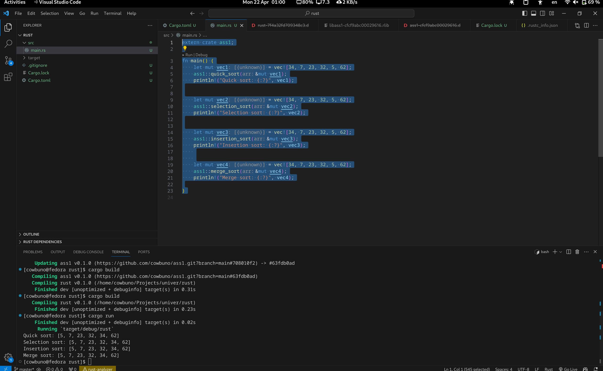

# Sorting Library

## Usage

### import
Cargo toml
```
[dependencies]
sorting_library = { git = "https://github.com/cowbuno/ass1.git", branch = "main" }
```

### Build
bash
```
cargo build
```

### Example


## License 

Copyright (c) Talipov Zhenis SE-2204 Blockchain 2
